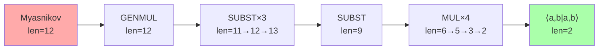
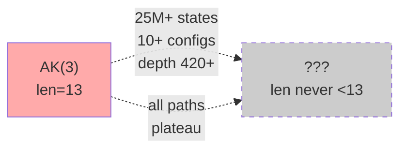
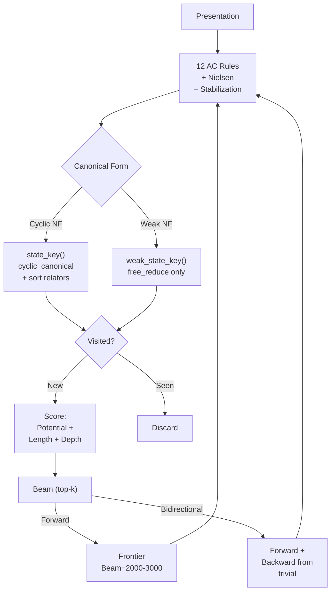

# Andrews–Curtis Conjecture: Computational Search for Counterexamples

Investigations into the Andrews–Curtis conjecture (1965) via massive computational search of the AC move graph.

## The Problem

The **Andrews–Curtis conjecture** states that every **balanced presentation** of the trivial group can be reduced to the trivial presentation $\langle x_1,\dots,x_n \mid x_1,\dots,x_n \rangle$ by a finite sequence of moves:

| Move | Operation |
|------|-----------|
| (AC1) $r_i \to r_i^{-1}$ | Invert a relator |
| (AC2) $r_i \leftrightarrow r_j$ | Permute relators |
| (AC3) $r_i \to r_i r_j\;(j\neq i)$ | Multiply one relator by another |
| (AC3') $r_i \to g^{-1} r_i g$ | Conjugate a relator by a generator |

Despite 60 years of effort, the conjecture remains **open** (2026). It is widely believed **false**, but no counterexample has been found. This repository describes a computational search for one.

## Primary Target: AK(3)

**AK(3)** = $\langle a,b \mid a^3 b^4,\; a b a b^{-1} a^{-1} b^{-1} \rangle$

A member of the Akbulut–Kirby series of balanced presentations of the trivial group. Total length: 13 (7 + 6). All members AK($n$) for $n \geq 3$ are potential counterexamples to the conjecture.

## The Capstone Result

**AK(3) resists every computational trivialization attempt.** After exploring **25M+ states** across **10+ distinct search configurations**, exactly **zero** presentations with total length < 13 were found.

```text
Total Length of AK(3) Under Search
━━━━━━━━━━━━━━━━━━━━━━━━━━━━━━━━━━━
len=13 ━━━━━━━━━━━━━━━━━━━━━━━━━━━━ ● ━━━ (25M+ states, never drops)
                                    │
len=12                               │ (never reached)
                                    │
len=2  ━━━━━━━━━━━━━━━━━━━━━━━━━━━━━ ● ━━ (trivial — never reached)
        0               5M              10M
                     States Explored
```

### Largest Single Run

```text
  beam = 3000   depth = 420   states = 10,014,630   elapsed = 42 min
  length: ████████████████████████████████████████ 13  (never changed)
  cyclic: ████████████████████████████████████████ 13  (never changed)
```

## Why This Matters

If AK(3) were AC-trivializable, there must exist a finite sequence of AC moves reducing it to the trivial presentation. This sequence would pass through intermediate presentations — some shorter, some longer. Every known AC-trivializable 2-generator presentation shows length reduction within the first few thousand states of beam search:

### Benchmark: Myasnikov (solvable in 9 steps)

**Myasnikov** = $\langle a,b \mid a^3 b^2,\; b a b^{-1} a^{-1} b^{-1} a^{-1} \rangle$ (total length 12)



Solved bidirectionally in **9 steps** (5 forward + 4 backward), requiring only **5,189 states**. The forward-only solver finds it in 14 steps with 3,403 states.

### AK(3) vs Myasnikov: Search Contrast

| Property | Myasnikov | AK(3) |
|----------|-----------|-------|
| Start length | 12 | 13 |
| Solved? | ✓ Yes | ✗ No |
| Steps required | 9 (bidir) | — |
| States to solution | 5,189 | 25M+ (no solution) |
| Length reduction | 12 → 2 | 13 → 13 (flat) |
| Peak length en route | 13 | — |



## Search Architecture



### Search Configurations Tested

| Configuration | Beam | States | Depth | Best Len |
|--------------|------|--------|-------|----------|
| Cyclic NF + subst + gen | 2000 | 227 299 | 500 | 13 |
| Cyclic NF + subst + gen | 2000 | 1 868 077 | 500 | 13 |
| **Cyclic NF, no subst** | **3000** | **10 014 630** | **420** | **13** |
| Weak NF + subst + gen | 2000 | 571 338 | 11 | 13 |
| Bidirectional cyclic NF | 2000 | 401 450 | 500 | 13 |
| Novelty search | 2000 | 5 049 655 | 103 | 13 |
| Substitution BFS | 500 | 317 631 | 20 | 13 |
| **Total** | — | **~25M** | — | **13** |

## Mathematical Interpretation

The total length function $L(P) = \sum_i |r_i|$ (sum of free-reduced relator lengths) defines a **potential function** on the AC move graph. A trivialization sequence must eventually reach $L = 2$ (the trivial 2-generator presentation). For Myasnikov, $L$ fluctuates 12→11→12→13→9→...→2. For AK(3), **every** state reachable within our search has $L \geq 13$.

```text
Length trajectory comparison
━━━━━━━━━━━━━━━━━━━━━━━━━━━━━━━━━━━━━━━━━━━━━━━
L=13 ─── AK(3) plateau ─────────────────────────
      ╱    ╲
L=12 ─╯      ╲── Myasnikov trajectory ──────────
               ╲
L=9  ───────────╯── Myasnikov break ────────────
                 ╲
                  ╲
L=2  ──────────────╰── trivial ─────────────────
```

This is consistent with AK(3) being a **genuine counterexample** to the Andrews–Curtis conjecture: a balanced presentation of the trivial group that cannot be transformed to the trivial presentation by AC moves alone.

## Repository Structure

```
├── README.md                 # This file
├── RESULTS.md                # Full experimental log
├── src/
│   ├── ac_solver_v3.py       # Core Presentation class, 12 AC rules, canonical forms
│   ├── ac_solver_v4.py       # Structural potential analysis
│   ├── ac_solver_v5.py       # Merged solver: bidir search, weak NF, novelty, CLI
│   ├── ak3_attack.py         # Three parallel attack strategies
│   └── ga_solver.py          # Genetic algorithm solver (experimental)
├── results/                  # All experimental output
└── references/               # Bibliography
```

## References

- Andrews, J. J. and Curtis, M. L. *Free groups and handlebodies*. Proc. Amer. Math. Soc. 16 (1965), 192–195.
- Andrews, J. J. and Curtis, M. L. *Extended Nielsen Operations in Free Groups*. Amer. Math. Monthly 73 (1966), 21–28.
- Bridson, M. R. *The complexity of balanced presentations and the Andrews-Curtis conjecture*. arXiv:1504.04187 (2015).
- Lisitsa, A. *Automated theorem proving reveals a lengthy Andrews–Curtis trivialization*. Examples and Counterexamples (2025).
